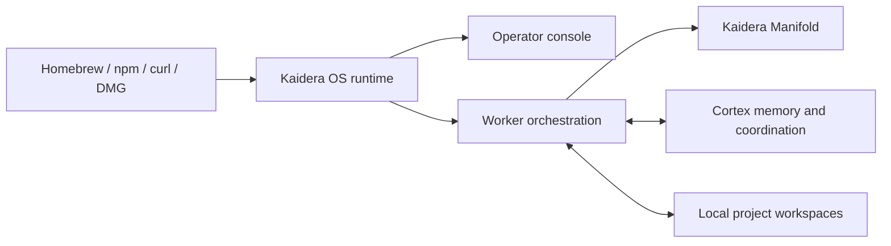

# Kaidera OS distribution

Public installers, package launchers, and signed releases for
[Kaidera OS](https://github.com/Kaidera-AI/kaidera-os), the open-source local
control plane for AI worker teams powered by Cortex.

**[Download for macOS](https://kaidera.ai/downloads/kaidera-os/macos)** |
**[Browse the source](https://github.com/Kaidera-AI/kaidera-os)** |
**[Documentation](https://docs.kaidera.ai)** |
**[Contribute](CONTRIBUTING.md)** |
**[Enterprise](https://kaidera.ai/for-enterprise)**

Kaidera OS connects project workspaces, AI harnesses, model providers, and
**Cortex** so AI workers can plan, execute, review, and resume work without losing
project context. This repository delivers the same versioned runtime through
Homebrew, npm, curl, and signed macOS disk images.

## Install

Kaidera OS requires Docker and Python 3.12 or newer. The command-line channels
support macOS and Linux.

### macOS

Download the signed and notarized installer from the
[Kaidera OS macOS page](https://kaidera.ai/downloads/kaidera-os/macos).

- [Kaidera OS Console DMG](https://github.com/Kaidera-AI/homebrew-kaidera/releases/download/v0.1.231/kaidera-os-console-v0.1.231.dmg)
- [Optional Kaidera OS Operator DMG](https://github.com/Kaidera-AI/homebrew-kaidera/releases/download/v0.1.231/kaidera-os-operator-v0.1.231.dmg)

Install the Console first. It contains the full runtime and requires macOS 14 or
newer, Docker, and Python 3. The optional Operator is a native menu-bar controller
for an existing installation. Release `v0.1.231` is validated on Apple Silicon.

### Homebrew

```sh
brew install kaidera-ai/kaidera/kaidera-os
kaidera-os install
kaidera-os start
```

### npm

```sh
npm install --global @kaidera/kaidera-os
kaidera-os install
```

### curl

```sh
repo=Kaidera-AI/homebrew-kaidera
curl -fsSL "https://raw.githubusercontent.com/$repo/main/install.sh" | bash
```

The curl and npm launchers verify the release SHA-256 before extracting. Homebrew
verifies the same digest from the formula. npm releases use GitHub OIDC trusted
publishing instead of a long-lived registry token.

## What gets installed



The packaged public edition exposes the Kaidera Manifold provider surface. A
source checkout exposes the complete local provider catalogue for development and
testing. **Cortex remains Cortex:** it is the permanent memory and coordination
component included with every Kaidera OS distribution.

Read [How Kaidera OS works](docs/HOW_IT_WORKS.md) for the worker lifecycle,
project boundaries, provider discovery, and release model.

## Source and contributions

Runtime development happens in the public
[`Kaidera-AI/kaidera-os`](https://github.com/Kaidera-AI/kaidera-os) repository.
This repository owns distribution concerns: installers, the Homebrew formula, npm
launcher, signed release assets, and channel documentation.

Bug reports, focused fixes, tests, documentation, accessibility improvements, and
portable installer enhancements are welcome. See [Contributing](CONTRIBUTING.md)
before opening an issue or pull request. Maintainers can use the
[community collaboration guide](docs/MAINTAINER_GUIDE.md) for collaborator access,
review, merge, and release practices.

## Upgrade

```sh
brew update && brew upgrade kaidera-os
npm update --global @kaidera/kaidera-os
```

The runtime keeps Cortex data in persistent storage while updating the application
payload.

## Kaidera AI

Kaidera AI is the enterprise platform for designing, governing, and operating AI
worker organizations. The managed service adds enterprise identity, governed
workspaces, Manifold model routing, operational controls, and implementation
support around Kaidera OS and Cortex.

- [Kaidera AI](https://kaidera.ai)
- [Enterprise service](https://kaidera.ai/for-enterprise)
- [Technology overview](https://kaidera.ai/technology)
- [Documentation](https://docs.kaidera.ai)
- [Kaidera AI on GitHub](https://github.com/Kaidera-AI)

## License

The source in this repository is licensed under the
[GNU Affero General Public License v3.0 only](LICENSE). Contributions are accepted
under the same license. Kaidera names and logos are not granted for use by the
software license; see [`NOTICE`](NOTICE).
