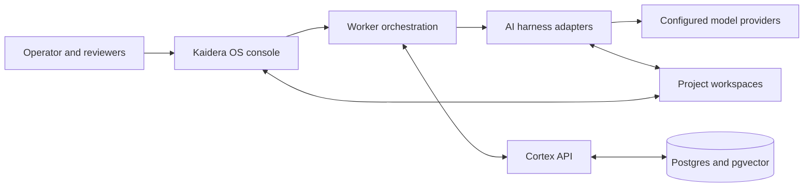

# How Kaidera OS works

Kaidera OS is a local control plane for AI worker teams. It connects project
workspaces, model providers, harnesses, and Cortex so work can be planned,
executed, reviewed, and resumed without losing project context.

## System overview

## Main components

### Kaidera OS console

The console is the operator surface. It registers projects and workers, shows
handoffs and run state, configures supported providers, and exposes controls for
starting, stopping, reviewing, and recovering work.

### Worker orchestration

The orchestration layer watches project handoffs and schedules eligible workers.
It maintains run state, heartbeats, approval gates, and failure recovery. A worker
is never just a chat tab: it has a project identity, role, scope, and auditable
work item.

### Harness adapters

Harness adapters connect Kaidera OS to supported AI coding and agent runtimes.
Provider and model catalogues are discovered dynamically where the provider
supports discovery. Credentials stay in local configuration and are not committed
to source control.

### Cortex

Cortex is the permanent name of Kaidera's project memory and coordination layer.
It stores decisions, handoffs, evidence, work products, messages, artifacts, and
retrieval indexes. Project boundaries are enforced so one project's context does
not silently become another project's instructions.

### Project workspaces

Customer and project files live outside the Kaidera OS product payload. A fresh
installation contains no baked project or worker team. The startup flow registers
the first workspace and creates local runtime configuration for that project.

## A typical work cycle

1. An operator registers a project workspace and worker team.
2. A lead worker turns an objective into scoped handoffs and acceptance criteria.
3. The orchestrator assigns eligible work to specialist workers.
4. Harness adapters run those workers against the selected model provider.
5. Workers read and update the project workspace within their configured sandbox.
6. Cortex records run state, decisions, evidence, and completed work products.
7. Human review gates approve material changes before merge, release, or delivery.
8. Later workers resume from Cortex context instead of rediscovering completed work.

## Installation channels

All public installation channels resolve to the same versioned release payload:

- **macOS Console DMG:** the full runtime in a signed and notarized disk image.
- **macOS Operator DMG:** the optional native controller for an existing install.
- **Homebrew:** the versioned runtime plus the `kaidera-os` CLI.
- **npm:** a small launcher that downloads and verifies the matching runtime.
- **curl:** the release archive and checksum followed by the canonical installer.

Release archives and DMGs are versioned. Installers verify SHA-256 before using
a downloaded runtime. npm publications use GitHub OIDC trusted publishing rather
than a long-lived registry token.

## Local and enterprise use

Kaidera OS provides the local worker and Cortex runtime. The Kaidera enterprise
service adds managed workspaces, identity and access controls, governed model
routing, operational support, and organization-level delivery controls.

- [Kaidera website](https://kaidera.ai)
- [Enterprise service](https://kaidera.ai/for-enterprise)
- [Technology overview](https://kaidera.ai/technology)
- [Documentation](https://docs.kaidera.ai)

## Security boundaries

- Secrets belong in local environment or credential stores, never in Git.
- Cortex commands use the API boundary rather than direct database access.
- Project identity and handoff routing are project-scoped.
- Public release files are checksummed; macOS images are signed and notarized.
- Untrusted pull-request code must never run with release, signing, or registry
  credentials.

## Learn more

- [Kaidera OS community source](https://github.com/Kaidera-AI/kaidera-os)
- [Install Kaidera OS on macOS](https://kaidera.ai/downloads/kaidera-os/macos)
- [Contributing](../CONTRIBUTING.md)
- [Maintaining community contributions](MAINTAINER_GUIDE.md)
- [Public releases](https://github.com/Kaidera-AI/homebrew-kaidera/releases)
